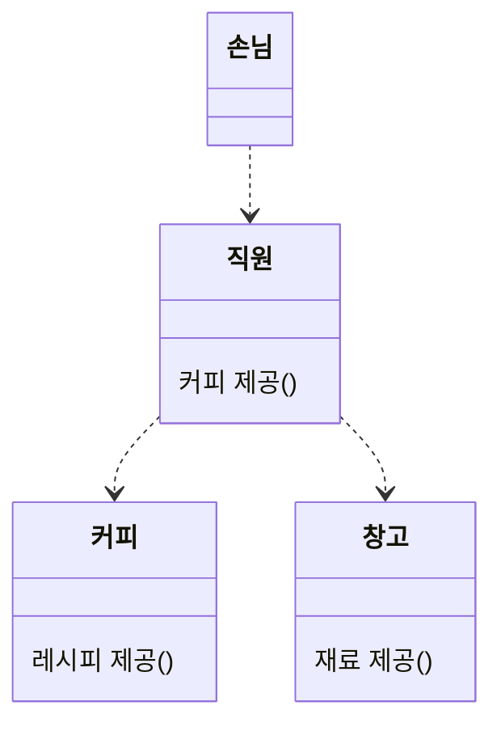

# 미션 코스 1주차

## 이번 미션은 순수한 Java 코드로 진행됩니다.
스프링을 위한 미션 코스인데 왜 그런지 의문이 드실 수 있을 것 같아요.  
왜 그런 식으로 진행하는지 간단하게 설명해볼께요.  
저는 백엔드 프로젝트를 크게 3개의 계층으로 나눠서 생각해요. 디자인 패턴으로는 3-Tier Architecture 라고도 하죠.  
DB 와의 통신을 담당하는 DB 계층, 서비스 관련 로직을 담당하는 서비스 계층, 전달하는 통신 게층 이렇게 3개이에요.  

DB 계층은 ORM, 흔히 사용하는 JPA, 하이버네이트 를 통해 구현돼요.  
통신 계층은 스프링 프레임워크를 통해 구현돼요.  
즉, 이 둘은 생각보다 정형화되어있고, 어떻게든 작동하면 전체 서비스는 작동한다고 생각해요.  
  
하지만, 서비스 계층은 이야기가 조금 달라요.  
받은 데이터 기반으로 가공, 처리, 검증을 통해 필요한 정보를 넘겨야하죠.  
서비스마다 천차만별이기 때문에, 전형적인 자료를 찾기 어렵다고 생각해요.  
즉, 이런 부분을 도와주는 것이 향후 백엔드 서비스 구축에 조금 더 도움이 되지 않을까 싶어 이런 방식을 채택했어요.

## 객체지향
여러분은 객체지향을 얼마나 알고 계신가요?  
첫 주차에는 프레임워크 없이 순수 언어를 사용해서 하는 이번 미션을 통해  
객체지향을 되돌아 보아요.  
  
여러분은 `객체지향` 하면 어떤 말이 떠오르나요?  
저는 정의를 먼저 확인하는걸 좋아하는데요  
위키피디아에 따르면...  
```
Object-oriented programming (OOP) is a programming paradigm
based on the concept of objects which can contain data and code.
```
...별 도움은 되지 않는군요.  
굳이 찾아보자면, Object, 즉 객체라는 개념에 중심을 둔 패러다임이라고 하는군요.  

이 객체가 무엇인지, 어떤 식으로 설계하고 사용하는지 간단히 알아보고, 이번 미션을 수행해보아요.

### 객체란?
현실의 문제를 객체간의 `협력 관계`를 통해 해결하고자 하는 것이 객체지향의 목적이에요.  
좀 더 풀어서 말하면, 각 객체에게 일정한 `책임`을 부과하고, 객체 간에 `메세지` 를 통해, `협력` 하여 주어진 문제를 해결해요.    

예를 들어보면, 카페에서 손님이 직원에게 커피를 사려고 한다고 해볼께요.

직원은 손님에게 `커피를 제공`이라는 `메세지`를 받았어요.  
이에 직원은 커피를 만들어 제공해야하는 `책임` 이 생겼어요.  
직원은 `커피 제공` 이라는 `책임`을 위해 `커피` 와 `창고` 객체의 `협력` 을 받아요.  

이런 식으로, 객체지향은 객체간의 `협력` 으로 문제를 해결해요.  

### 객체 설계하기
객체지향적 설계를 위해서는 `메세지`, 혹은 기능을 먼저 정의해야 해요.  
이 `메세지` 를 묶어 `책임` 을 설정하고, `협력 관계` 를 구성해요.  
바로 위의 예시를 가져와볼께요.  
커피 주문이라는 문제를 위해서는 다음과 같은 기능이 필요해요.  
* 커피를 만들기
* 재료를 파악하기
* (재료가 무제한은 아닐테니) 재료의 양을 구하기
* 재료의 양을 관리하기  

이 정도로 정리해볼께요.  
책임을 부과해본다면,
* 커피 만들기는 직원이
* 재료를 파악하기는 커피가
* 재료의 양을 구하고, 관리하기는 창고가

하는 것이 자연스러워보여요. 협력 관계도 볼까요?  
커피를 만들기 위해, 커피에게 재료를 파악 후, 창고에게 만들 수 있는지 확인하면 되겠네요.  

이정도로 객체에 대한 복습을 간단하게 해보았어요.  
그럼 이제 본격적으로 미션을 수행해볼까요? -> [미션코스 1주차 명세서](./1st-spec.md)
