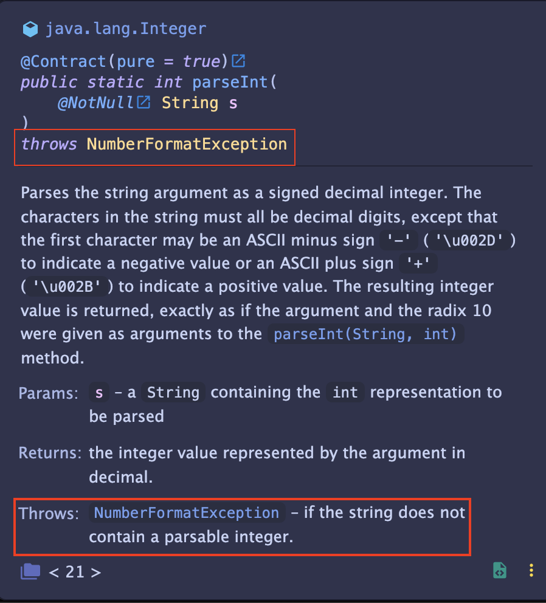

# try-catch 문법
자바는 기본적으로 예외 처리를 `exception` 을 통해 다뤄요.  
자세한 내용은 다음 글을 참고하면 좋을 거 같아요.  

> [자바의 에러](https://inpa.tistory.com/entry/JAVA-%E2%98%95-%EC%97%90%EB%9F%ACError-%EC%99%80-%EC%98%88%EC%99%B8-%ED%81%B4%EB%9E%98%EC%8A%A4Exception-%F0%9F%92%AF-%EC%B4%9D%EC%A0%95%EB%A6%AC)  
> [에러 처리: try-catch](https://inpa.tistory.com/entry/JAVA-%E2%98%95-%EC%98%88%EC%99%B8-%EC%B2%98%EB%A6%ACException-%EB%AC%B8%EB%B2%95-%EC%9D%91%EC%9A%A9-%EC%A0%95%EB%A6%AC)

저러한 에러들은 `try-catch` 라는 문법을 이용하여, 개발자가 예외 처리를 해요.  
이 때, 그 자리에서 바로 처리할지, 아니면 호출하는 함수(caller) 에서 처리할지 결정해줘야해요.  
간단한 예시를 볼께요.  
```java
    public int parseIntWithNoError(String str) {
    try {
        return Integer.parseInt(str);
    } catch(NumberFormatException e) {
        return 0;
    }
}
```
원래 `parseInt` 는 `NumberFormatException` 예외를 던지는 함수예요.  
intellij 에서 함수에 마우스를 갖다대면 아래와 같은 이미지가 나와요.  

어떤 에러를 던지는지 미리 알 수 있어요.

이 에러는 잘못된 형식을 입력할 시, 0 이라는 기본값을 반환하도록 되어 있어요.  
이처럼 기본값 등으로 에러를 정정할 수도, 에러를 발생시켜 시스템을 정지시킬 수도 있어요.  

하지만, 한편으로는 에러가 발생하는 곳에서 산발적으로 처리하면 불편하다고 여길 수도 있어요.  
한 곳에 모아서 처리하고 싶을 때는 `throws` 를 사용하면 됩니다.  
위의 예시를 조금 변형해볼께요.
```java
    public int parseIntThrowError(String str) throws NumberFormatException{
        return Integer.parseInt(str);
}
```
(사실 `Integer.parseInt` 메소드랑 큰 차이는 없지만 예시로서 봐주세요!)  
이제 이 함수에서의 에러처리에 대한 책임은 호출자 메소드(caller)로 넘어갑니다.  

예컨데 다음과 같아요.
```java
    public static void main(String[] args) {
        String str = "100";
        try {
            parseIntThrowError(str);
        } catch(NumberFormatException e) {
            System.out.println(0);
        }
    }
```
`parseIntThrowError` 에서 처리하지 않고, 메소드를 부른 `main` 함수에서 처리하도록 할 수 있어요.  
이런 식으로 에러를 한 곳에서 처리하도록, 에러 처리의 책임을 상위 메소드에게 부여하는 역할을 해줘요.

이렇게 적절한 에러 표시와 처리를 통해 예외상황을 잘 처리할 수 있답니다.